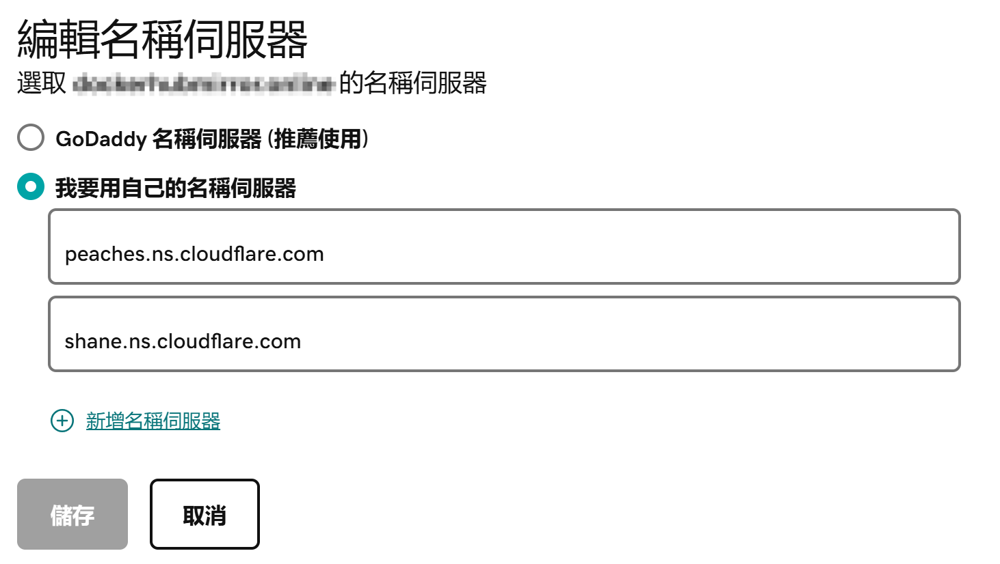

当我们购买了一个域名之后，必须要做的一件事就是将域名绑定到服务器的 IP 地址上。这个过程是通过在域名注册商那里修改 DNS 设置实现的。当我们在域名注册商那里购买一个域名之后，我们就可以通过域名注册商的控制面板来管理域名的 DNS 设置。

## 指定 DNS 服务器

通常来说，域名注册商会有自己的 DNS 服务器。默认情况下，域名会使用域名注册商自己的 DNS 服务器，但我们也可以改为第三方的 DNS 服务器。下图是 GoDaddy 的配置页面，图中我选择使用 CloudFlare 的 DNS 服务器。

## 修改 DNS 记录

假如我们选择使用域名注册商的 DNS 服务器，那么修改 DNS 记录就是在域名注册商的控制面板上进行。如果选用第三方的 DNS 服务器，那么配置就是在第三方服务商的控制面板上进行。

假设我们购买的域名是 foo.com。一个典型的 DNS 记录表如下所示：

| Type  | Name | Data      |
| ----- | ---- | --------- |
| A     | @    | 11.4.5.14 |
| CNAME | www  | foo.com   |

首先是最核心的 A 记录。Name 的@可以理解为是空值的意思。第一行的 A 记录的意思是：foo.com 的 IP 地址是 11.4.5.14。

然后是 CNAME 记录。第二行的 CNAME 记录的含义是：www.foo.com的IP地址等于foo.com的IP地址。

通过这两行记录，foo.com 和www.foo.com的IP地址都会被设定为11.4.5.14。
