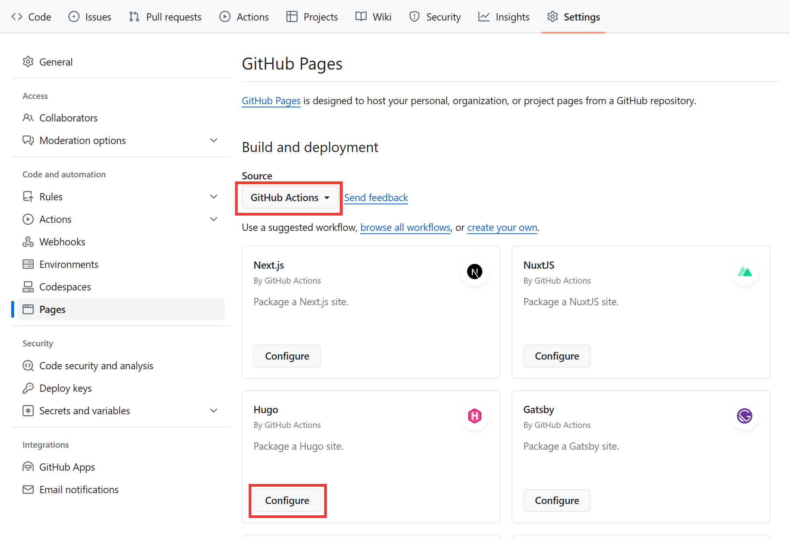

作为准备工作，你需要在电脑上安装Hugo。具体的安装步骤请参照[Hugo官网](https://gohugo.io/installation/)。

然后在GitHub上创建一个仓库，仓库名为\<username\>.github.io。例如我的GitHub用户名为shi0rik0，就创建一个名为shi0rik0.github.io的仓库。

然后打开仓库的"Settings"->"Pages"，将"Source"改为"GitHub Actions"。修改之后，你会看到下方有一些GitHub推荐的workflow，这里选择将Hugo的workflow添加到仓库中。



接下来执行以下命令。

```bash
git clone <your-repo>
cd <your-repo>
hugo new site . --force
git submodule add https://github.com/theNewDynamic/gohugo-theme-ananke.git themes/ananke
echo "theme = 'ananke'" >> hugo.toml
hugo new content posts/my-first-post.md
```

执行完之后，你就已经初始化了一个使用ananke主题的Hugo网站，并创建了第一篇博文`posts/my-first-post.md`。打开`posts/my-first-post.md`，你应该会看到下面的内容：

```
+++
title = 'My First Post'
date = 2024-01-14T07:07:07+01:00
draft = true
+++
```

将`title`改成你想要的标题，并将`draft`改为false。接下来你就可以在下面用Markdown的语法写你的博文了。写完之后，可以用`hugo server`命令启动一个HTTP服务器来预览你的网站。确认完没问题后，就可以把更改提交到远程仓库上了。

```
git add .
git commit -m "init blog"
git push
```

Push之后，GitHub的Hugo workflow会自动生成并部署网站。过一段时间后，你应该就可以在\<username\>.github.io上看到你的网站了。