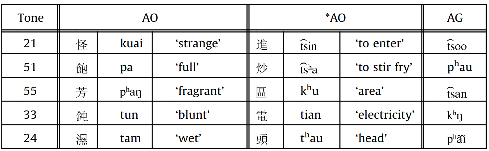
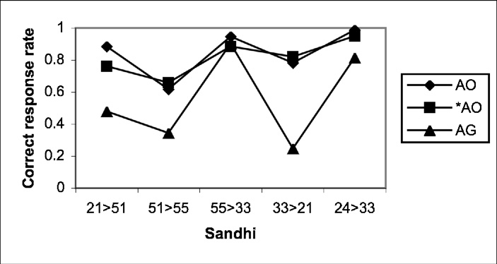

最近粗略翻阅了一本学术著作《基于启动和脑电波实验研究普通话和闽南语连续变调词的储存模式》。书中第二章和第三章针对普通话和闽南话的变调规则做了一个实验。实验流程是这样的，以普通话的“3-3→2-3”规则（比如辅导 fu3dao3 实际上会念成 fu2dao3）为例。实验人员让被试者听一些词语，然后让被试者判断这些词语是不是真实存在的词语。在让被试者听一个词语之前，会播放这个词的第一字作为刺激。实验分为两组，第一组播放的刺激是变调前的发音，比如播放“辅导”之前会先播放“fu3”的声音。另一组则会提前播放变调后的发音，比如播放“辅导”之前会先播放“fu2”的声音。然后比较两组实验中被试者的反应时间和准确率。除了普通话的“3-3→2-3”规则，研究者还针对闽南语的“24→33”规则（例如“平等”）和“51→55”规则（例如“主持”）也做了相同的实验。

实验结果如下表所示：

| 变调规则        | 刺激效果（变调前） | 刺激效果（变调后） |
| --------------- | ------------------ | ------------------ |
| 普通话“3-3→2-3” | 有                 | 无                 |
| 闽南语“24→33”   | 有（较好）         | 有（较差）         |
| 闽南语“51→55”   | 有（较差）         | 有（较好）         |

表格中所说的“有刺激效果”的意思是，播放刺激声音后，被试者的反应速度和准确率提高了。

从实验结果可以看出，对于不同变调规则，播放变调前和变调后的声音的刺激效果是不一样，并且两者之间存在负相关的关系。

作者还认为，播放变调前声音的刺激效果与变调规则的能产性（productivity）是正相关的。依据是有文献（[Modeling Taiwanese speakers’ knowledge of tone sandhi in reduplication](http://dx.doi.org/10.1016/j.lingua.2010.06.010)）表明闽南语“24→33”规则的能产性高于“51→55”规则。

在该文献中，研究者做了这么一个实验：他们给闽南语母语者播放一个字 A，然后让被试者念出这个字的重叠形式 AA，例如“怪”→“怪怪”，然后分析变调的准确率。用于测试的字可以分为三组：AO、\*AO 和 AG。其中 AG 是并不存在的字（不算声调的话，发音是合法的，但是算上声调就不存在这么发音的字），而 AO 和\*AO 都是真实存在的字，不过对于 AO 组的字而言，其重叠形式的词是真实存在的，而\*AO 组中的字并不存在重叠形式的词。下图给出了这三组字的例子：

该实验的测试结果如下图所示：

从中可以明显看出“24→33”规则的变调准确率远远高于“51→55”规则，特别是对于 AG 组。这就说明“24→33”规则的能产性更高。
