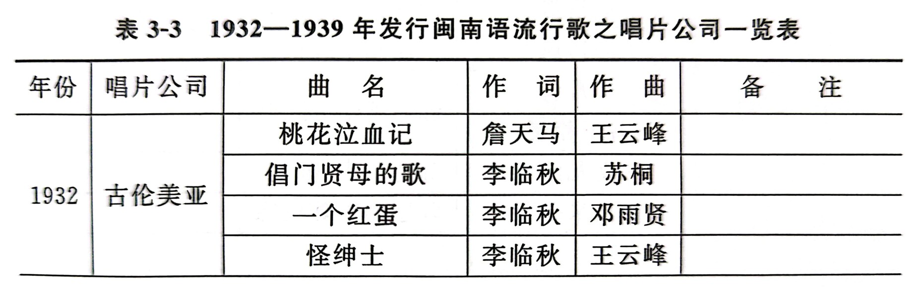
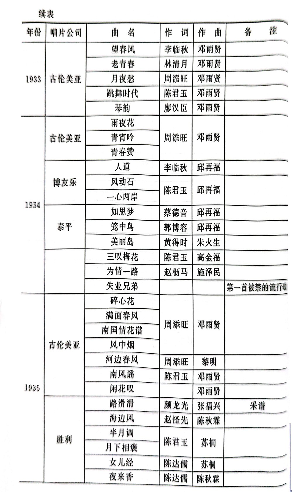
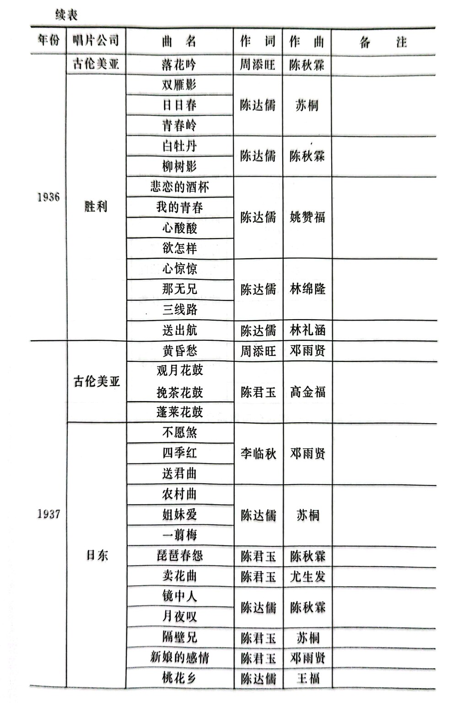
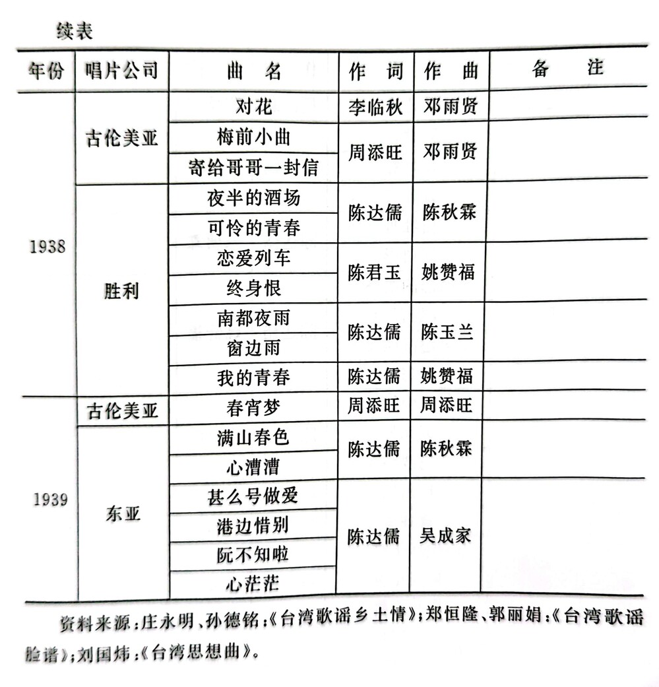

最近阅读了厦门大学出版社出版的《传播与流变: 海峡两岸闽南语歌曲研究》，发现 91 页有一个表格，列举了所有 1932-1939 年的台语歌曲。于是我便在 YouTube Music 上建立了[一个歌单](https://music.youtube.com/playlist?list=PLjJvx372ZSwVyV4QIobEW8sg_PXNus5RY&si=7-SCelc4h2IjIuwB)，收集了表格中的经典台语歌曲。由于 YouTube Music 音源有限，因此遗漏了一些歌曲。这些缺失的歌曲可以在[台湾声音一百年](https://audio.nmth.gov.tw/audio)里面找到。

下面是原表格：

