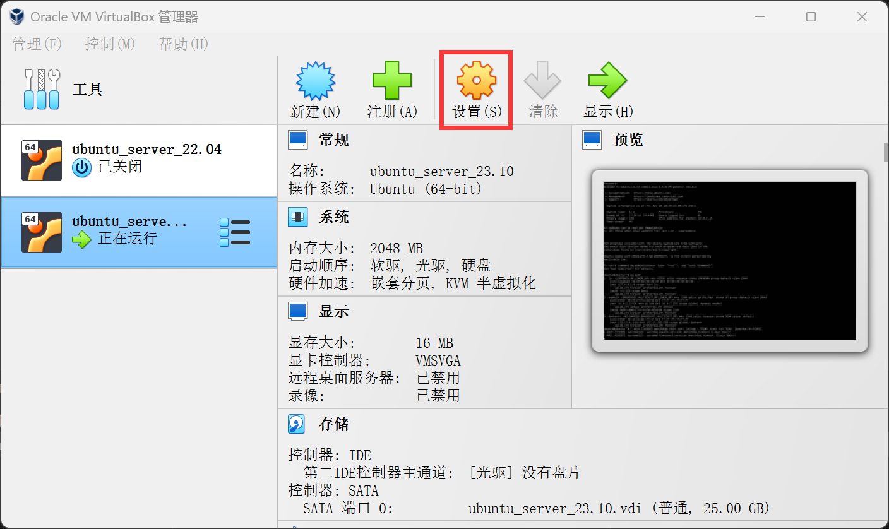
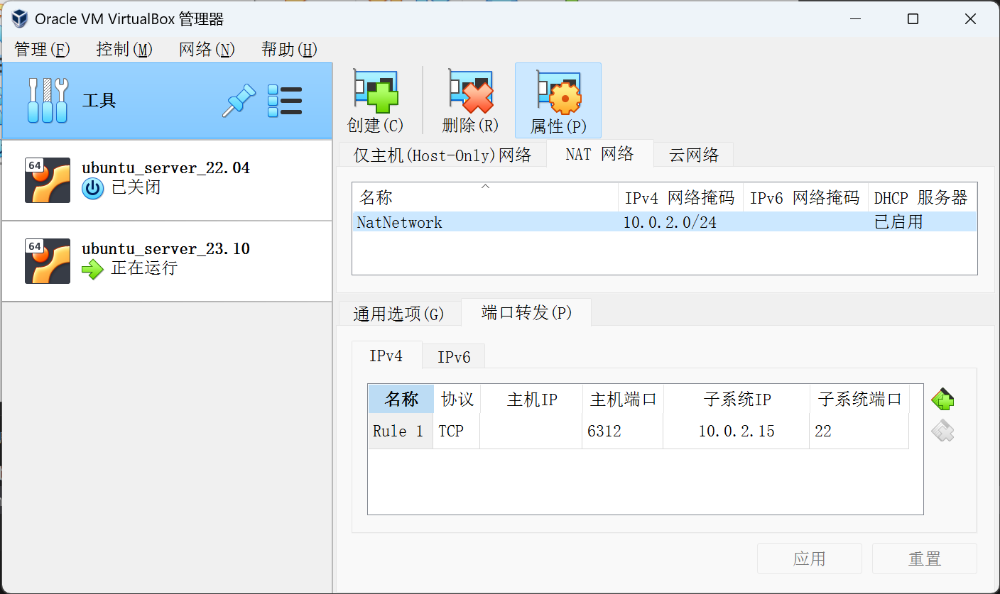

## 虚拟机连接主机

VirtualBox 已经默认建立了一个网卡，可以通过这个网卡和主机通信。

首先点击菜单栏的“管理”->“工具”->“网络管理器”。

然后就可以在“仅主机(Host-Only)网络”里看到网卡的 IP 地址。图中所示的地址是 192.168.56.1。

## 主机连接虚拟机

VirtualBox 默认的 NAT 网络只能支持虚拟机与主机或外网通信，主机是无法与虚拟机通信的。有时候我们需要让主机与虚拟机通信，比如让主机连接虚拟机的 SSH 等等。这种情况下，我们需要手动配置 VirtualBox 的端口转发。

首先打开虚拟机的设置。

把虚拟机网卡的连接方式改为“NAT 网络”（注意不是默认的“网络地址转换(NAT)”！）。网络名称用默认已经建立好的“NatNetwork”就可以。

然后点击菜单栏的“管理”->“工具”->“网络管理器”。

最后在 NAT 网络的端口转发里新增一条转发规则即可。这里我增加的规则是将 localhost:6312（主机）转发到 10.0.2.15:22（虚拟机）。10.0.2.15 是虚拟机的 IP。

