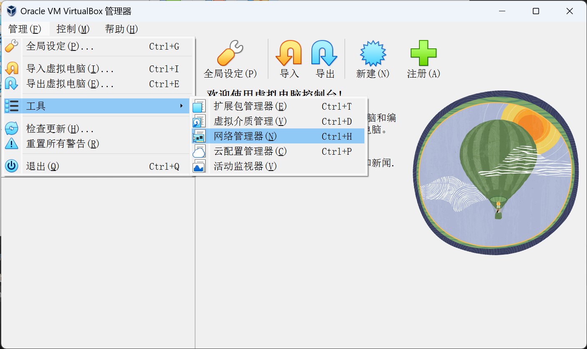

VirtualBox默认的NAT网络只能支持虚拟机与主机或外网通信，主机是无法与虚拟机通信的。有时候我们需要让主机与虚拟机通信，比如让主机连接虚拟机的SSH等等。这种情况下，我们需要手动配置VirtualBox的端口转发。

首先打开虚拟机的设置。

把虚拟机网卡的连接方式改为“NAT网络”（注意不是默认的“网络地址转换(NAT)”！）。网络名称用默认已经建立好的“NatNetwork”就可以。

然后点击菜单栏的“管理”->“工具”->“网络管理器”。

最后在NAT网络的端口转发里新增一条转发规则即可。这里我增加的规则是将localhost:6312（主机）转发到10.0.2.15:22（虚拟机）。10.0.2.15是虚拟机的IP。

